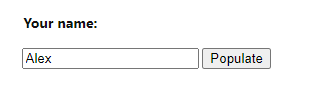
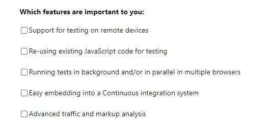
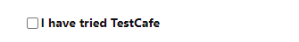
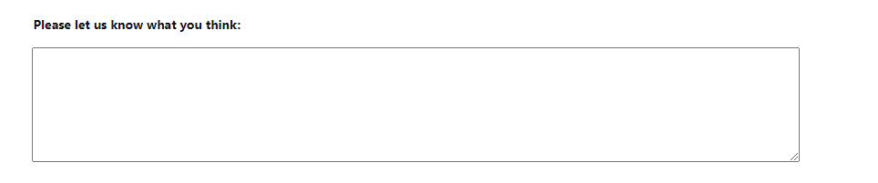
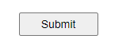
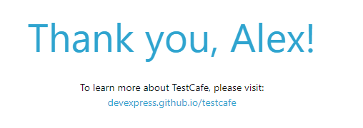

# Домашка

- Откройте https://devexpress.github.io/testcafe/example/
- Введите своё имя в поле **Your Name**:

- Выберите все checkboxes:

- Выберите checkbox:

- Напишите что нибудь в текстовом поле

- Нажмите на кнопку

### На новой странице проверяем:

- Текст элемента

- Адрес страницы
- Заголовок страницы

_*** Можно использовать Thread.sleep для ожидания результатов._